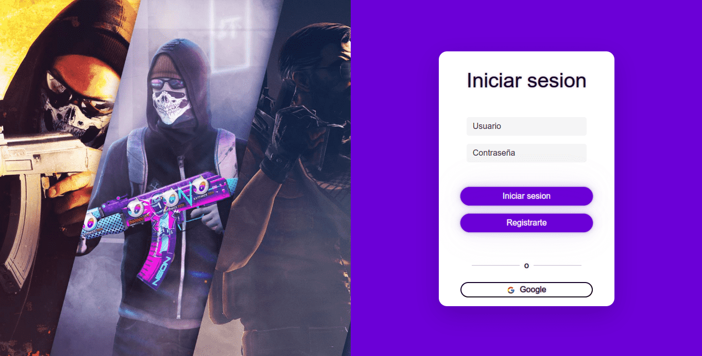

# InGamers
---


## InGamers es una comunidad de gamers en la que compartir contenido y poder interactuar con otros jugadores.

Es posible crear una cuenta en InGamers para poder acceder a todas las funcionalidades de la comunidad.
Puedes tener un perfil personal con tu nombre, avatar y una descripción. En el podrás mostrar tus juegos favoritos, tus redes sociales y tus habilidades.
En el feed podras ver los contenidos de la comunidad y también los de tus amigos. Allí podrá encontrar jugadores con los que formar equipos.


Link: https://ingamers-delta.vercel.app/

---

## Tecnologías

- [React](https://reactjs.org/)
- [Redux](https://redux.js.org/)
- [React-Router](https://reactrouterdotcom.fly.dev/)
- [Bootstrap](https://getbootstrap.com/)
- [Bootswatch](https://bootswatch.com/)
- [Reactstrap](https://reactstrap.github.io/)
- [React-Icons](https://react-icons.netlify.com/)
- [Sass](https://sass-lang.com/)
---

## Roles

- Carlos García (Team Leader)
- Cristian Palomeque (Backend)
- Vladimir Sanchez Astoray (UX/UI)
- Alejandro Pedroza (Frontend)
- Mauricio Romero (Frontend)
---

## Como correr el proyecto

Deberás tener instalado [Node.js](https://nodejs.org/en/).
Una vez copiado el proyecto en tu equipo y ubicado en la carpeta del mismo, deberás ejecutar los siguiente comando:

```
npm install
npm start
```

El proyecto se ejecutará y se abrirá automáticamente en el navegador.


